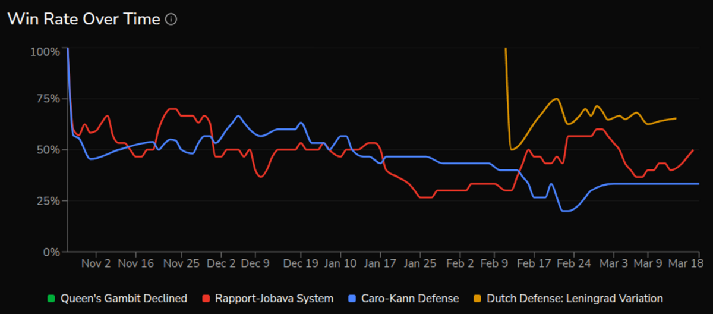
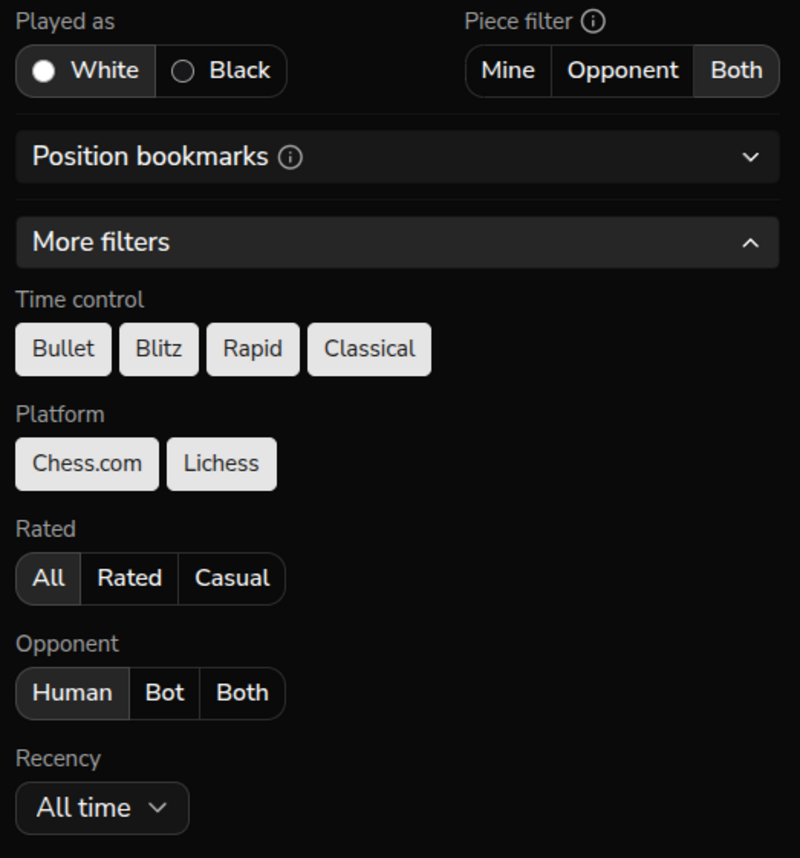
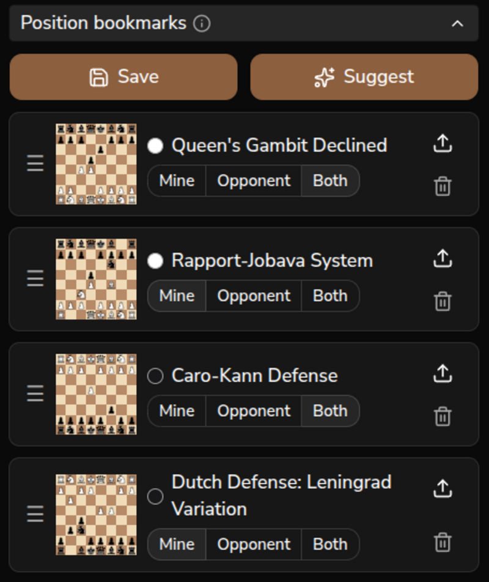

<p align="center">
  
</p>

<h1 align="center">FlawChess</h1>

<p align="center">
  <em>Engines are flawless, humans play FlawChess</em>
</p>

<p align="center">
  <a href="https://github.com/flawchess/flawchess/actions/workflows/ci.yml"></a>
  
  
  
  
  
</p>

## What is FlawChess?

FlawChess is a chess opening analysis platform that matches positions by Zobrist hash — not by opening name. Import your games from chess.com and lichess, then analyze win/draw/loss rates for any exact board position you specify. Stop guessing which "Sicilian line" lost you points; find out which specific positions you actually struggle with.

## Screenshots

**Board & Move Explorer** — Navigate positions and see next-move frequency with W/D/L stats


**Win Rate Over Time** — Track how your results evolve across months



**Powerful Filters** — Slice results by time control, rating, color, platform, recency, and more



**Position Bookmarks** — Save any position for instant recall during future sessions



## Features

- **Find weaknesses in your openings** — analyze W/D/L rates for any board position across all your games
- **Scout your opponents** — load an opponent's username and study their opening tendencies
- **Interactive move explorer** — play moves on the board to navigate positions; see next-move frequency and W/D/L stats per move
- **Cross-platform analysis** — import from chess.com and lichess in one place, analyze combined results
- **Powerful filters** — filter by time control, rating, color, opponent type, platform, recency, and more
- **Mobile-friendly PWA** — installable on Android and iOS, optimized for touch
- **Open source** — self-hostable, MIT licensed

## Tech Stack

| Layer | Technology |
|-------|------------|
| Backend | FastAPI, Python 3.13, SQLAlchemy 2.x, Alembic |
| Frontend | React 19, TypeScript, Vite 5, Tailwind CSS |
| Database | PostgreSQL 16 |
| Chess | python-chess (Zobrist hashing), chess.js, react-chessboard |
| Auth | FastAPI-Users (JWT + Google OAuth) |
| Monitoring | Sentry |
| Hosting | Docker Compose, Caddy (auto-TLS), Hetzner VPS |

## Getting Started

### Prerequisites

- Python 3.13
- Node.js 20+
- Docker

### Setup

```bash
# Clone
git clone https://github.com/flawchess/flawchess.git
cd flawchess

# Start PostgreSQL
docker compose -f docker-compose.dev.yml -p flawchess-dev up -d

# Backend
cp .env.example .env  # Edit with your settings
uv sync
uv run alembic upgrade head
uv run uvicorn app.main:app --reload

# Frontend (new terminal)
cd frontend
npm install
npm run dev
```

The API will be available at `http://localhost:8000`. Interactive docs at `http://localhost:8000/docs`. The frontend dev server runs at `http://localhost:5173`.

> **Note:** Google OAuth and Sentry are optional — the app works with email/password auth and without error monitoring. Leave `GOOGLE_OAUTH_CLIENT_ID`, `GOOGLE_OAUTH_CLIENT_SECRET`, and `SENTRY_DSN` empty to skip them.

### Running Tests

```bash
uv run pytest        # Run all tests
uv run pytest -x     # Stop on first failure
```

### Linting

```bash
uv run ruff check .  # Backend lint
uv run ruff format . # Backend format
cd frontend && npm run lint  # Frontend lint
```

## Self-Hosting

Deploy the full stack on any VPS using Docker Compose. Caddy handles automatic TLS certificate provisioning.

### Prerequisites

- VPS with Docker and Docker Compose installed (e.g. Hetzner CX32)
- A domain name with DNS pointing to your server

### Steps

```bash
# 1. Clone the repository
git clone https://github.com/flawchess/flawchess.git
cd flawchess

# 2. Create and configure the environment file
cp .env.example .env
```

Edit `.env` and set the following required values:

| Variable | Description |
|----------|-------------|
| `ENVIRONMENT` | Set to `production` |
| `POSTGRES_PASSWORD` | Strong password (`openssl rand -hex 16`) |
| `SECRET_KEY` | JWT secret (`openssl rand -hex 32`) |
| `DATABASE_URL` | `postgresql+asyncpg://flawchess:<password>@db:5432/flawchess` |
| `BACKEND_URL` | `https://yourdomain.com` |
| `FRONTEND_URL` | `https://yourdomain.com` |

```bash
# 3. Start all services
docker compose up -d
```

- **Auto-TLS:** Caddy automatically provisions and renews Let's Encrypt certificates.
- **Migrations:** Alembic migrations run automatically on backend container startup.
- **Optional:** `GOOGLE_OAUTH_CLIENT_ID`/`GOOGLE_OAUTH_CLIENT_SECRET` enable Google sign-in. `SENTRY_DSN`/`VITE_SENTRY_DSN` enable error monitoring. Both are fully optional.

## Architecture: Zobrist Hash Position Matching

The core idea: positions are matched via precomputed 64-bit Zobrist hashes rather than FEN string comparison or opening name. Three hashes are computed at import time for every half-move:

- **white_hash** — white pieces only (enables "my pieces only" queries)
- **black_hash** — black pieces only
- **full_hash** — complete board position

All hashes are stored in the `game_positions` table, turning position queries into fast indexed integer lookups. This solves the inconsistent opening categorization problem — two games in the same position are guaranteed to match, regardless of how the platform labels the opening.

## Contributing

Contributions are welcome. Please open an issue to discuss a feature or bug before submitting a pull request — this keeps effort aligned and avoids duplicate work.

Code style:
- Python: [Ruff](https://docs.astral.sh/ruff/) for linting and formatting (`uv run ruff check .` / `uv run ruff format .`)
- TypeScript: ESLint (`npm run lint` in the `frontend/` directory)

## License

MIT — see [LICENSE](LICENSE).

## Links

- Live app: https://flawchess.com
- Contact: support@flawchess.com
