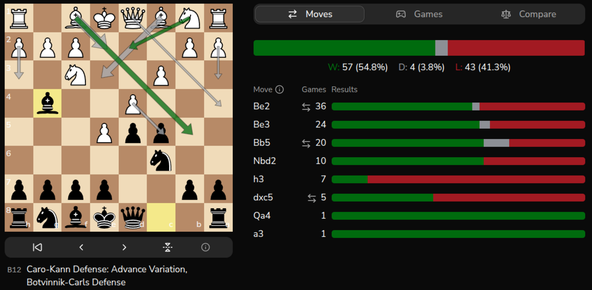

<p align="center">
  
</p>

<h1 align="center">FlawChess</h1>

<p align="center">
  <em>Engines are flawless, humans play FlawChess</em>
</p>

<p align="center">
  <a href="https://github.com/flawchess/flawchess/actions/workflows/ci.yml"></a>
  
  
  
  
  
</p>

## What is FlawChess?

FlawChess is a chess opening analysis platform that matches positions by Zobrist hash — not by opening name. Import your games from chess.com and lichess, then analyze win/draw/loss rates for any exact board position you specify. Stop guessing which "Sicilian line" lost you points; find out which specific positions you actually struggle with.



## Features

- **Find weaknesses in your openings** — analyze W/D/L rates for any board position across all your games
- **Scout your opponents** — load an opponent's username and study their opening tendencies
- **Interactive move explorer** — play moves on the board to navigate positions; see next-move frequency and W/D/L stats per move
- **Cross-platform analysis** — import from chess.com and lichess in one place, analyze combined results
- **Powerful filters** — filter by time control, rating, color, opponent type, platform, recency, and more
- **Mobile-friendly PWA** — installable on Android and iOS, optimized for touch
- **Open source** — self-hostable, MIT licensed

## Tech Stack

| Layer | Technology |
|-------|------------|
| Backend | FastAPI, Python 3.13, SQLAlchemy 2.x, Alembic |
| Frontend | React 19, TypeScript, Vite 5, Tailwind CSS |
| Database | PostgreSQL 18 |
| Chess | python-chess (Zobrist hashing), chess.js, react-chessboard |
| Auth | FastAPI-Users (JWT + Google OAuth) |
| Monitoring | Sentry |
| Hosting | Docker Compose, Caddy (auto-TLS), Hetzner VPS |

## Getting Started

### Prerequisites

- Python 3.13 + [uv](https://docs.astral.sh/uv/)
- Node.js 20+
- Docker

### Setup

```bash
git clone https://github.com/flawchess/flawchess.git
cd flawchess
cp .env.example .env  # Edit with your settings
bin/run_local.sh
```

The script starts PostgreSQL (Docker), installs dependencies, runs migrations, and launches both backend and frontend. The API is at `http://localhost:8000` (docs at `/docs`), frontend at `http://localhost:5173`.

> **Note:** Google OAuth and Sentry are optional — the app works with email/password auth and without error monitoring. Leave those `.env` values empty to skip them.

### Running Tests

```bash
uv run pytest        # Run all tests
uv run pytest -x     # Stop on first failure
```

### Linting

```bash
uv run ruff check .  # Backend lint
uv run ruff format . # Backend format
cd frontend && npm run lint  # Frontend lint
```

## Contributing

Contributions are welcome. Please open an issue to discuss a feature or bug before submitting a pull request — this keeps effort aligned and avoids duplicate work.

Code style:
- Python: [Ruff](https://docs.astral.sh/ruff/) for linting and formatting (`uv run ruff check .` / `uv run ruff format .`)
- TypeScript: ESLint (`npm run lint` in the `frontend/` directory)

## License

MIT — see [LICENSE](LICENSE).

## Links

- Live app: https://flawchess.com
- Contact: support@flawchess.com
