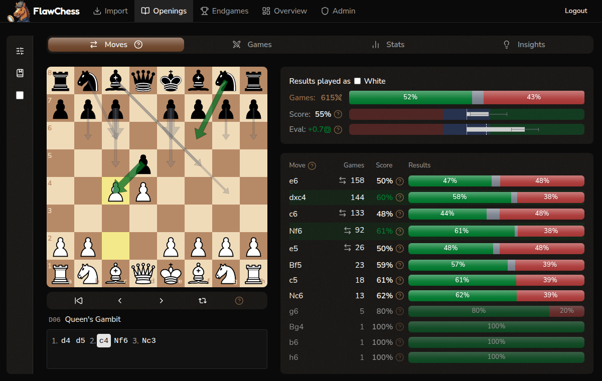

<p align="center">
  
</p>

<h1 align="center">FlawChess</h1>

<p align="center">
  <em>Engines are flawless, humans play FlawChess</em>
</p>

<p align="center">
  Live at <a href="https://flawchess.com"><strong>flawchess.com</strong></a>
</p>

<p align="center">
  <a href="https://github.com/flawchess/flawchess/actions/workflows/ci.yml"></a>
  <a href="https://github.com/flawchess/flawchess/actions/workflows/github-code-scanning/codeql"></a>
  <a href="https://docs.renovatebot.com"></a>
  
  
  
  
  
</p>

## What is FlawChess?

A free, open-source chess analysis platform. Import games from chess.com and lichess to analyze your openings by position (not just name), track endgame performance by category, and find exactly where you win and lose. FlawChess matches positions via Zobrist hashes for precise, cross-platform analysis.



## Features

- **Interactive opening explorer** — step through any opening and see your win/draw/loss rate for every move, scout opponents before a match, discover which moves you struggle against
- **Opening comparison and tracking** — bookmark openings and compare their performance, track how your opening study impacts your win rate over time, filter by time control
- **System opening filter** — filter by your pieces only to analyze system openings like the London across all opponent variations
- **Endgame analytics** — win/draw/loss rates by endgame type (rook, minor piece, pawn, queen, mixed), material conversion and recovery statistics, performance gauges and timelines
- **Cross-platform import** — import from chess.com and lichess, sync new games, scout opponents by importing their games
- **Mobile-friendly PWA** — installable on Android and iOS, optimized for touch
- **Open source** — self-hostable, MIT licensed

## Tech Stack

| Layer | Technology |
|-------|------------|
| Backend | FastAPI, Python 3.13, SQLAlchemy 2.x, Alembic |
| Frontend | React 19, TypeScript, Vite 5, Tailwind CSS |
| Database | PostgreSQL 18 |
| Chess | python-chess (Zobrist hashing), chess.js, react-chessboard |
| Auth | FastAPI-Users (JWT + Google OAuth) |
| Monitoring | Sentry |
| Hosting | Docker Compose, Caddy (auto-TLS), Hetzner VPS |

## Getting Started

### Prerequisites

- Python 3.13 + [uv](https://docs.astral.sh/uv/)
- Node.js 20+
- Docker

### Setup

```bash
git clone https://github.com/flawchess/flawchess.git
cd flawchess
cp .env.example .env  # Edit with your settings
bin/run_local.sh
```

The script starts PostgreSQL (Docker), installs dependencies, runs migrations, seeds the openings reference table, and launches both backend and frontend. The API is at `http://localhost:8000` (docs at `/docs`), frontend at `http://localhost:5173`.

> **Note:** Google OAuth and Sentry are optional — the app works with email/password auth and without error monitoring. Leave those `.env` values empty to skip them.

### Running Tests

```bash
uv run pytest        # Run all tests
uv run pytest -x     # Stop on first failure
```

### Test Coverage

Backend uses `pytest-cov` (already in dev dependencies):

```bash
uv run pytest --cov=app --cov-report=term-missing   # Terminal report with missing lines
uv run pytest --cov=app --cov-report=html           # HTML report at htmlcov/index.html
```

Frontend uses Vitest's coverage (v8 provider):

```bash
cd frontend
npx vitest run --coverage                           # Terminal + HTML at coverage/index.html
```

### Linting & Type Checking

```bash
uv run ruff check .           # Backend lint
uv run ruff format .          # Backend format
uv run ty check app/ tests/   # Backend type check (zero errors required)
cd frontend && npm run lint   # Frontend lint
```

The CI pipeline runs these in order: ruff (lint) → [ty](https://github.com/astral-sh/ty) (type check) → pytest (tests). All three must pass.

## Backups & Recovery

The production VM is backed up by Hetzner's **automatic daily whole-server backup** feature with a 7-day rolling retention. Snapshots are managed by Hetzner and stored off the VM — a full disk loss can be recovered from the previous day's snapshot via the Hetzner Cloud Console.

- **Frequency:** daily, managed by Hetzner
- **Retention:** 7 days (rolling)
- **Scope:** full server image (PostgreSQL data volume included)
- **RPO:** up to 24 hours
- **PITR:** not enabled (point-in-time recovery would require WAL archiving in addition to the daily snapshot)

For deeper data-corruption scenarios that slip past 7 days (e.g. a silent bug that corrupts rows across weeks), a logical `pg_dump` retained separately would be a useful second layer but is not currently configured.

## Changelog & Releases

Release notes are published per milestone on the [GitHub Releases](https://github.com/flawchess/flawchess/releases) page. The full history across all milestones lives in [CHANGELOG.md](CHANGELOG.md), which follows a [Keep a Changelog](https://keepachangelog.com/en/1.1.0/) -inspired format.

## Contributing

Contributions are welcome. Please open an issue to discuss a feature or bug before submitting a pull request — this keeps effort aligned and avoids duplicate work.

Code style:
- Python: [Ruff](https://docs.astral.sh/ruff/) for linting and formatting, [ty](https://github.com/astral-sh/ty) for static type checking — `uv run ty check app/ tests/` must pass with zero errors
- TypeScript: ESLint (`npm run lint` in the `frontend/` directory)

## License

MIT — see [LICENSE](LICENSE).

## Links

- Live app: https://flawchess.com
- Contact: support@flawchess.com
