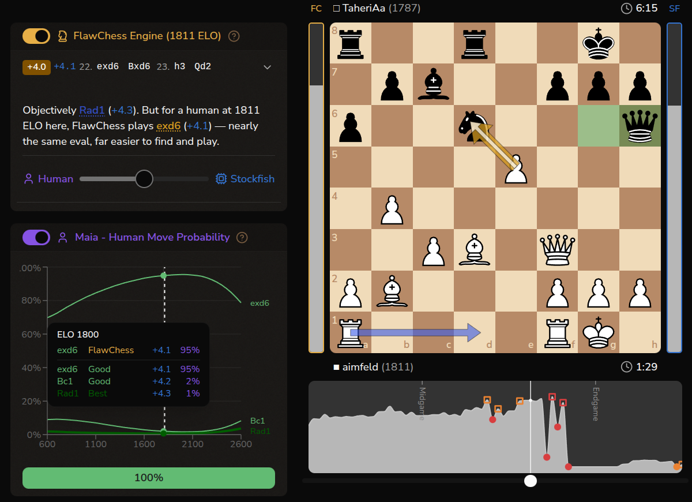

<p align="center">
  
</p>

<h1 align="center">FlawChess</h1>

<p align="center">
  <em>Engines are flawless, humans play FlawChess</em>
</p>

<p align="center">
  Live at <a href="https://flawchess.com"><strong>flawchess.com</strong></a>
</p>

<p align="center">
  <a href="https://github.com/flawchess/flawchess/actions/workflows/ci.yml"></a>
  <a href="https://github.com/flawchess/flawchess/actions/workflows/github-code-scanning/codeql"></a>
  <a href="https://docs.renovatebot.com"></a>
  
  
  
  
  
</p>

## What is FlawChess?

A free, open-source chess analysis platform. Import your games from chess.com and lichess to find leaks in your openings, endgames, and time management. Its signature FlawChess Engine ranks moves by the practical score you'll actually achieve against a real opponent at your level, not the objective-best move a conventional engine would play.



## Features

- **FlawChess Engine**: an in-browser engine that ranks your moves by expected practical score: the best move you'll actually pull off against an opponent who defends like a real player at your level. Fuses Stockfish's objective evaluation with Maia's human move-prediction (expectimax inside an MCTS budget allocator), and surfaces the traps and swindles a conventional engine ignores.
- **Game & tactic analysis**: Stockfish over your entire game history, with every mistake tagged by the tactic behind it (fork, pin, skewer, and 20+ motifs), blunder-rate trends over time, and gem-move detection for the only good move most players at your rating would miss.
- **Personalized puzzle training**: a spaced-repetition drill built from your own blunders rather than a generic puzzle set. Each session mixes real blunders with quiet positions where several moves are fine, so you commit to "one critical move or several fine moves?" before playing; missed positions return next session, then after three days, then ten, until solved three times and retired.
- **Human-like bots**: 24 named opponents driven by the FlawChess Engine, spanning four playing styles (Attacker, Trickster, Grinder, Wall) across six approximate rating rungs from 800 to 1800, each a fully pinned personality with its own opening book, resign and draw-offer policy, and bio. Clocked play, and every finished game lands in your library as an analyzable game like any other.
- **Endgame analytics**: WDL by endgame type (rook, minor piece, pawn, queen, mixed), conversion rates when up material and recovery rates when down, Endgame ELO timeline per platform/time control, and LLM-narrated personalized feedback explaining what your stats mean.
- **Opening explorer & insights**: step through any position and see your WDL per candidate move; an automatic 16-half-move scan surfaces opening strengths and weaknesses with deep-links into the explorer; works for scouting opponents too.
- **Time management stats**: clock advantage/deficit at endgame entry, performance under matching time pressure vs opponents, flag rates per time control.
- **Opening comparison & tracking**: bookmark openings and compare WDL trends over time, filter by time control to see what works where.
- **System opening filter**: filter by your pieces only to analyze system openings like the London across all opponent variations.
- **Cross-platform import**: combine chess.com and lichess games, filter by color, time control, opponent type, and recency.
- **Mobile-friendly PWA**: installable on Android and iOS, optimized for touch.
- **Open source**: self-hostable, AGPL-3.0 licensed.

## Tech Stack

| Layer | Technology |
|-------|------------|
| Backend | FastAPI, Python 3.14, SQLAlchemy 2.x, Alembic |
| Frontend | React 19, TypeScript, Vite 5, Tailwind CSS |
| Database | PostgreSQL 18 |
| Chess | python-chess (Zobrist hashing), chess.js, react-chessboard |
| Auth | FastAPI-Users (JWT + Google OAuth) |
| Monitoring | Sentry |
| Hosting | Docker Compose, Caddy (auto-TLS), Hetzner Cloud CPX42 (8 vCPU, 16 GB RAM, 160 GB NVMe) |

## Engine Binaries (GPLv3 License Note)

The files `frontend/public/engine/stockfish-18-lite-single.js` and `frontend/public/engine/stockfish-18-lite-single.wasm` are vendored from the `stockfish` npm package v18.0.8 ([nmrugg/stockfish.js](https://github.com/nmrugg/stockfish.js)) and are licensed under the [GNU General Public License v3 (GPL-3.0)](https://www.gnu.org/licenses/gpl-3.0.html). These binaries are loaded in a dedicated Web Worker process, which keeps the GPL non-infective for the FlawChess application code (Worker process boundary). All other FlawChess code is AGPL-3.0 licensed (see the LICENSE file).

- Package: `stockfish` v18.0.8
- Vendored files: `stockfish-18-lite-single.js`, `stockfish-18-lite-single.wasm`
- License: GPL-3.0
- Source: https://github.com/nmrugg/stockfish.js

## Sound Assets

The files under `frontend/public/sound/` come from three different sources. Check
which group a file belongs to before assuming its license.

**1. `Move.mp3`, `Capture.mp3`, `Check.mp3`, `GameStart.mp3`, `LowTime.mp3`,
`Defeat.mp3`, `Notify.mp3`, `FullScore.mp3`** — taken from recordings downloaded
from [sounddino.com](https://sounddino.com/en/effects/chess/) on 2026-08-13
(2026-08-14 for `LowTime.mp3`, `Defeat.mp3`, `Notify.mp3` and `FullScore.mp3`):

| File | Source recording | Which hit |
|------|-----------------|-----------|
| `Move.mp3` | `/mp3/6/the-sound-of-arranging-pieces-one-by-one-on-a-chessboard.mp3` | 2nd of 9 (at 2.83s) |
| `Capture.mp3` | `/mp3/6/the-sound-of-arranging-pieces-one-by-one-on-a-chessboard.mp3` | 8th of 9 (at 22.13s) |
| `Check.mp3` | `/mp3/6/the-sound-of-arranging-pieces-one-by-one-on-a-chessboard.mp3` | 3rd of 9 (at 8.10s) |
| `GameStart.mp3` | `/mp3/6/there-is-such-an-option-small-figures.mp3` | whole recording, uncut |
| `LowTime.mp3` | `clock-stopwatch-ticking.mp3` (title tag "Clock: stopwatch ticking") | 6 ticks, onsets 12.502–13.504s |
| `Defeat.mp3` | `cello-sad-arpeggio.mp3` (title tag "Cello sad arpeggio", from the [cello category](https://sounddino.com/en/effects/cello/)) | opening phrase, 0–1.50s |
| `Notify.mp3` | `sound-messages-odnoklassniki.mp3` (title tag "Sound messages Odnoklassniki") | whole recording, uncut |
| `FullScore.mp3` | `small-victory.mp3` (title tag "small victory") | opening phrase, 0–1.10s |

`Move`, `Capture` and `Check` come from the same take. The source recordings are
multi-hit field recordings rather than one-shots, so "which hit" is what makes a
cut reproducible; each was isolated by onset detection, cut to a 90ms window from
3ms before the attack, and faded out. `GameStart.mp3` and `Notify.mp3` are the
two used whole (~0.78s and ~0.84s) — each marks a one-time event, so neither
needs shortening. Both sources are already single events rather than multi-hit
takes, and `Notify.mp3`'s own last ~0.2s is already below the noise floor, so
trimming it would only raise its measured RMS without changing what is heard.

`Defeat.mp3` is the source's opening phrase, not the whole 3.13s recording. The
source keeps bowing new notes until ~2.9s, so it is a real three-second phrase
rather than a short one with a long tail, and it cannot simply be truncated —
that would cut a note mid-attack. It is instead untouched to 1.15s and then
faded to silence by 1.50s on a raised-cosine taper, which lands the fade in the
gap before the next bowed note (onsets sit at ~0.08, 0.41, 0.73, 0.94, 1.49,
2.16 and 2.83s). Three seconds of cello is too long for a sound that also fires
on every zero-score Train puzzle, not just at the end of a bot game. Cut it at a
different length the same way — end the fade just before an onset, never on one.

`LowTime.mp3` is **not** a straight cut of its source. The recording ticks at
~5/s, which is too slow to read as urgent, and it ramps up in level across its 16
seconds — so the six ticks come from the loud, steady late region. Each tick was
extracted as its own 90ms grain (3ms pre-roll, 20ms tail taper; a tick is back at
the noise floor within ~40ms, so the grains never overlap) and re-placed at 1.5x
tempo, giving 7.5 ticks/s in 0.82s. **Speeding it up by resampling would raise the
pitch and a WSOLA time-stretch would smear the click transients** — re-placing the
grains does neither, and the source's natural tick jitter is preserved
proportionally so it does not sound machine-gridded. Verified by spectral
centroid: 6685 Hz before and after.

Those three are **loudness-matched, not peak-normalized**. Peak normalization
makes short percussive clips measure the same while sounding different, because a
sharp transient and a softer knock at equal peak are not equally loud. Each was
instead scaled to a common RMS, measured over the region above −40 dB of that
clip's own peak. Re-cut any replacement the same way, or it will not sit
correctly against the others.

`Capture` and `Check` then take one shared makeup gain so the louder of them
reaches 0.95 peak, landing at RMS ≈ 0.117 — in line with `GameStart.mp3` (0.122)
and within the lila clips' own range below. `LowTime` is matched the same way, to
RMS ≈ 0.095 / 0.67 peak: it is an alert rather than a per-move tick, but a
1.5-second-scale ticking clip at the event-sound level dominates whatever the user
is thinking about.

**`Move` deliberately takes only half that makeup gain** (+4.5 dB of the ~9 dB),
landing at RMS ≈ 0.070 / 0.50 peak, about 4.5 dB below `Capture` and `Check`.
This is intentional, not an oversight: the move sound fires on every single ply,
so at parity with the event sounds it dominates the mix and grates over a game,
while the bare matched level (RMS ≈ 0.042) proved too quiet to register. Keep the
gap if you replace it.

`Defeat` was matched the same way, to the level of the lila clip it replaced
(RMS ≈ 0.095 / 0.39 peak). Matching the outgoing clip rather than the makeup-gain
target keeps the win/loss pair balanced: `WinChime` sits at RMS ≈ 0.086, and a
sustained cello at the short event-sound level would read considerably louder
than a chime. Gain is applied after the fade and re-measured on the encoded mp3,
since trimming the quiet tail raises the clip's own RMS.

`FullScore.mp3` is the source's first 1.10s, faded out from 0.85s on the same
raised-cosine taper. Unlike the cello, the discarded part is pure reverb tail
with no further onsets — the phrase itself is over by ~0.5s and everything after
1.10s sits below −34 dB — so this is a tail trim, not a shortened phrase. It
matters because this clip fires on every fully-solved Train puzzle, and the
untrimmed 1.85s is the longest asset in the set. It is gain-matched to
`WinChime.mp3` (RMS ≈ 0.086), the clip it took over from at that moment.

`Notify.mp3` was likewise matched to the outgoing clip, `GenericNotify.mp3`
(RMS ≈ 0.122), which lands it between `WinChime` and `Defeat` — right for a
sound that plays both at a drawn game's end and on a declined draw offer. It
replaces `Draw.mp3` too, but was deliberately **not** matched to that one:
`Draw.mp3` peaked at 1.03 (clipped) and was the loudest asset in the set at
RMS ≈ 0.171. `Notify.mp3` peaks at 0.68. The source carries embedded cover art,
which is stripped on encode (`-map 0:a:0`) — leaving it in doubles the file
size for a picture nothing ever displays. Note that a 0.24 dB pre-gain measured
0.45 dB low after LAME encoding, so the gain was re-derived from the encoded
file and applied in a second pass, per the rule above.

sounddino.com publishes no license or terms page. Its only usage statement is the
category-page claim that the clips are royalty-free, require no attribution, and
are free for commercial use. We rely on that claim rather than on an explicit
per-file grant, which is a deliberate risk-based decision: these are short generic
clips and replacing any of them is a one-file swap. **Do not describe these files as
AGPLv3+ or CC0.** If a claim is ever raised, re-cut replacements from a CC0 source
(Freesound filtered to CC0, or OpenGameArt) and update this section.

**2. `Checkmate.mp3`, `PartialScore.mp3`** —
vendored from lichess's
[lila](https://github.com/lichess-org/lila) `public/sound/sfx` directory, created
by **Enigmahack**, licensed [AGPLv3+](https://www.gnu.org/licenses/agpl-3.0.html),
which is compatible with FlawChess's own AGPL-3.0 license (see `LICENSE`).

- Source: https://github.com/lichess-org/lila/tree/master/public/sound/sfx
- Author: Enigmahack
- License: AGPLv3+

`Checkmate.mp3` was byte-identical to the old `Check.mp3`, faithful to lila,
whose `sfx/Checkmate.mp3` is a symlink to `sfx/Check.mp3` — so checkmate used to
sound exactly like a check. Replacing `Check.mp3` from the sounddino take above
resolved that: the two are now distinct, and the contrast reads correctly (a
53ms dark knock for check, a 411ms bright lila flourish for checkmate).

`PartialScore.mp3` is lila's `sfx/LowTime.mp3`, renamed and otherwise untouched.
It is played for a mixed Train result (a partial per-puzzle score, and the yellow
session-verdict band), which is what it had always been used for here alongside
the bot-game clock warning. Once the clock warning became an actual ticking clock,
the shared file stopped making sense on a Train score, so the two split: the name
now describes the use, not the lila original.

`Defeat.mp3` used to be lila's `sfx/Defeat.mp3` and is now the sounddino cello
clip listed in group 1 — it is no longer an AGPLv3+ file. Likewise, lila's
`Draw.mp3` and `GenericNotify.mp3` were deleted outright: both events that
played them (a drawn bot game, and the bot declining a draw offer) now play
`Notify.mp3` from group 1.

**3. `WinChime.mp3`** — self-authored, released CC0 (no attribution required).
It plays only at the two moments that end something: a bot-game win, and a Train
session that finishes in the green band (≥75%). It used to play for a fully
solved single puzzle as well, which made one puzzle sound exactly like the whole
session; that moment now has `FullScore.mp3`. Keep the distinction if either is
re-cut — they are deliberately at the same level, so only the phrase separates
them.

Note on lila's other sound sets: only `sfx`, `piano`, `futuristic`, `nes`
(Enigmahack, AGPLv3+) and `lisp` (CC BY-NC-SA 4.0, NonCommercial so unusable here)
carry a license in lila's `COPYING.md`. Its default `standard` set is **not** among
them and falls under the catch-all "The other sounds in public/sound" bullet in
that file's **Exceptions (non-free)** section, so it must not be vendored.

## Getting Started

### Prerequisites

- Python 3.14 + [uv](https://docs.astral.sh/uv/)
- Node.js 20+
- Docker

### Setup

```bash
git clone https://github.com/flawchess/flawchess.git
cd flawchess
cp .env.example .env  # Edit with your settings
bin/run_local.sh
```

The script starts PostgreSQL (Docker), installs dependencies, runs migrations, seeds the openings reference table, installs the pinned Stockfish binary (via `bin/install_stockfish.sh` — same release and SHA-256 as the prod Docker image), and launches both backend and frontend. The API is at `http://localhost:8000` (docs at `/docs`), frontend at `http://localhost:5173`.

> **Note:** Google OAuth and Sentry are optional — the app works with email/password auth and without error monitoring. Leave those `.env` values empty to skip them.

> **Stockfish:** `bin/install_stockfish.sh` installs the pinned `sf_18` binary for your platform (Linux x86_64, macOS Apple Silicon, or macOS Intel) to `~/.local/stockfish/sf`, SHA-256 verified. The backend auto-discovers it (no `STOCKFISH_PATH` needed in dev); set `STOCKFISH_PATH` only to point at a binary in a non-standard location. Other platforms: install Stockfish manually and set `STOCKFISH_PATH`.

### Running Tests

```bash
uv run pytest          # Run all tests (serial)
uv run pytest -x       # Stop on first failure
uv run pytest -n auto  # Run in parallel across all CPU cores (much faster locally)
```

Each test run, and each `pytest-xdist` worker under `-n auto`, gets its own database cloned from a migrated template, so parallel and concurrent runs are fully isolated. `-n auto` is roughly 2x faster than serial on a multi-core machine. The template auto-refreshes whenever you add a migration, so there is no manual rebuild step. CI runs the suite serially for deterministic, bisectable logs; `-n auto` is a local convenience.

### Test Coverage

Backend uses `pytest-cov` (already in dev dependencies):

```bash
uv run pytest --cov=app --cov-report=term-missing   # Terminal report with missing lines
uv run pytest --cov=app --cov-report=html           # HTML report at htmlcov/index.html
```

Frontend uses Vitest's coverage (v8 provider):

```bash
cd frontend
npx vitest run --coverage                           # Terminal + HTML at coverage/index.html
```

### Linting & Type Checking

```bash
uv run ruff check .           # Backend lint
uv run ruff format .          # Backend format
uv run ty check app/ tests/ scripts/   # Backend type check (zero errors required)
cd frontend && npm run lint   # Frontend lint
```

The CI pipeline runs these in order: ruff (lint) → [ty](https://github.com/astral-sh/ty) (type check) → pytest (tests). All three must pass.

## Remote Stockfish Worker

Want to help out? You can run a standalone Stockfish worker to support the FlawChess server and speed up game analysis. No Docker or full dev setup required. See [REMOTE_WORKER.md](REMOTE_WORKER.md) for setup instructions (Linux, macOS, and Windows).

## Backups & Recovery

The production VM is backed up by Hetzner's **automatic daily whole-server backup** feature with a 7-day rolling retention. Snapshots are managed by Hetzner and stored off the VM — a full disk loss can be recovered from the previous day's snapshot via the Hetzner Cloud Console.

- **Frequency:** daily, managed by Hetzner
- **Retention:** 7 days (rolling)
- **Scope:** full server image (PostgreSQL data volume included)
- **RPO:** up to 24 hours
- **PITR:** not enabled (point-in-time recovery would require WAL archiving in addition to the daily snapshot)

For deeper data-corruption scenarios that slip past 7 days (e.g. a silent bug that corrupts rows across weeks), a logical `pg_dump` retained separately would be a useful second layer but is not currently configured.

## Changelog & Releases

Release notes are published per milestone on the [GitHub Releases](https://github.com/flawchess/flawchess/releases) page. The full history across all milestones lives in [CHANGELOG.md](CHANGELOG.md), which follows a [Keep a Changelog](https://keepachangelog.com/en/1.1.0/) -inspired format.

## Contributing

Contributions are welcome. Please open an issue to discuss a feature or bug before submitting a pull request — this keeps effort aligned and avoids duplicate work.

Code style:
- Python: [Ruff](https://docs.astral.sh/ruff/) for linting and formatting, [ty](https://github.com/astral-sh/ty) for static type checking — `uv run ty check app/ tests/ scripts/` must pass with zero errors
- TypeScript: ESLint (`npm run lint` in the `frontend/` directory)

## License

AGPL-3.0 — see [LICENSE](LICENSE). If you run a modified version of FlawChess as a network
service, the AGPL requires you to make your modified source available to its users (see
LICENSE §13).

## Links

- Live app: https://flawchess.com
- Contact: support@flawchess.com
